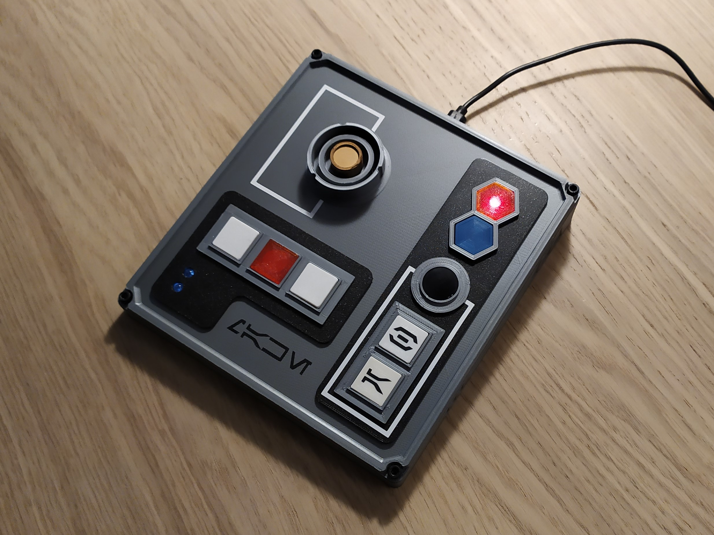
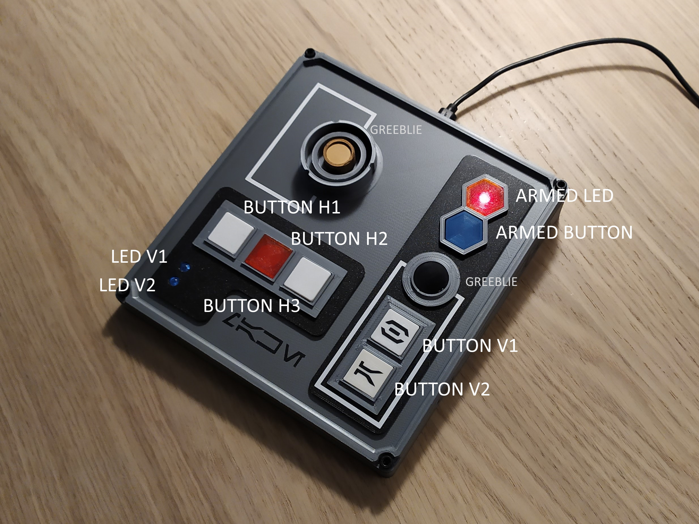
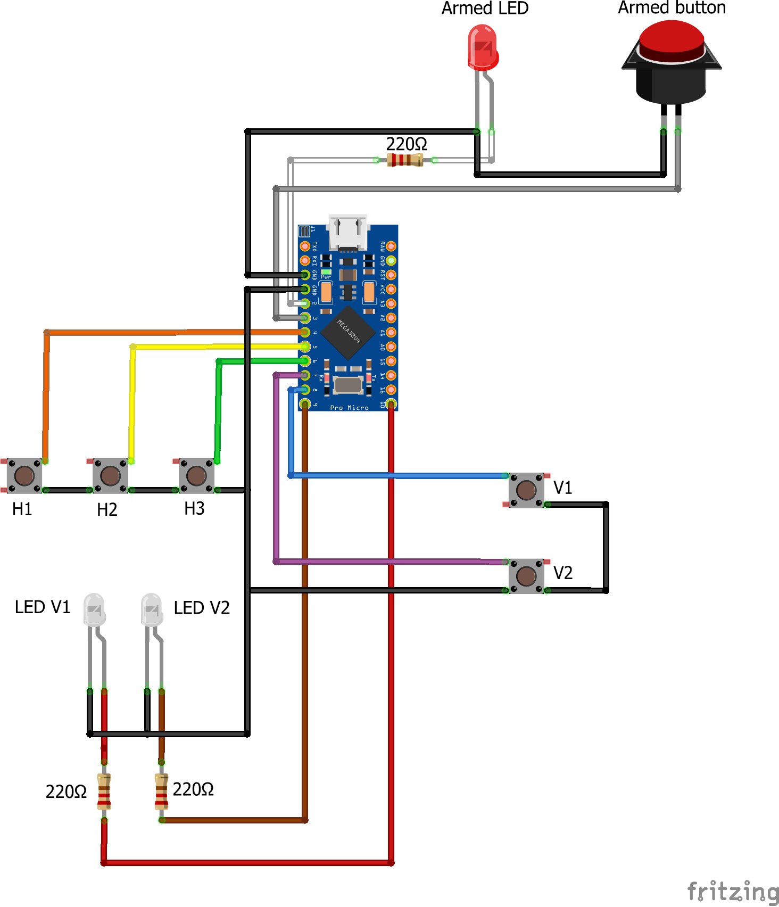

# Star Wars Macro Keyboard

This is a Star Wars theme inspired device that you can connect to your computer and it will act as a HID keyboard.

**Features:**
- 5 configurable buttons
- A safety switch with a safety LED
- 2 additional LEDs 
- 3D-printable case

## Getting Started

Coming soon...

## Configuration

In the source code you can define what keycodes will be sent when the buttons are pressed. Check for the `Key definitions` section and update the values for your needs.

Useful sources:
- [Keyboard Modifiers in the Arduino Reference](https://www.arduino.cc/reference/en/language/functions/usb/keyboard/keyboardmodifiers/)
- [usb_hid_keys.h](https://gist.github.com/MightyPork/6da26e382a7ad91b5496ee55fdc73db2)
- [USB HID Usage Table](https://www.freebsddiary.org/APC/usb_hid_usages.php)
- [USB HID Usage Tables specification](https://www.usb.org/sites/default/files/documents/hut1_12v2.pdf)

## Safety Switch

This device acts as a HID keyboard when connected to your computer via USB. If the code is faulty there's a chance that it will send random keycodes to your computer that can make uploading a fixed code impossible.

Safety switch to the rescue! If the safety switch is not pressed the keyboard will not send any keycodes to your computer, but keeps the code running on the Arduino, so you can keep it powered and upload new code to it.

## Parts List

- 1pc **Arduino Pro Micro** - do NOT use other Arduino boards as this is the one that has the `ATmega32U4` chip that provides the required USB capabilities. This board is available in two variants, I used the 5V version.
- 1pc **red LED**
- 2pcs **white LEDs**
- 3pcs **220Ω resistors** - you may need different values if you use different LEDs or the 3.3V Arduino Pro Micro
- 5pcs 12×12×7.3mm tactile **momentary button**
- 1pc 8×8mm **push-button switch**
- 5pcs M3x5 **screws** (4 for the cover, 1 for fixing the Arduino board)
- Wires
- Glue
- Optional: if you do not want to solder the wires directly to the Arduino you can use **right angle pin headers** and **Dupont connectors**. I used jumper wires.

## Naming

The following image shows how the buttons and LEDs are named both in the wiring diagram and in the code:

## Wiring

You can see the wiring in the [Fritzing file](./wiring/star-wars-macro-keyboard.fzz) in the `wiring` folder:

Notes:
- The `H1`-`H3` (horizontal) and the `V1`-`V2` (vertical) buttons are momentary buttons.
- The `Armed button` is a latching switch.
- You may need to adjust the resistors' values to the LEDs and the Arduino variant you use.
- The `LED V1` and `LED v2` must be connected to PWM ports to be dimmable from code.

## 3D-Printable Case

Coming soon...

## Texts

## Acknowledgements

This project was inspired by [David E. Madison's Building a DIY Stream Deck](https://www.partsnotincluded.com/diy-stream-deck-mini-macro-keyboard/) and [The Smugglers Room](https://www.thesmugglersroom.com/). Thanks both for sharing their passion and knowledge with the community.

## About the author

This project was created by [György Balássy](https://linkedin.com/in/balassy).
